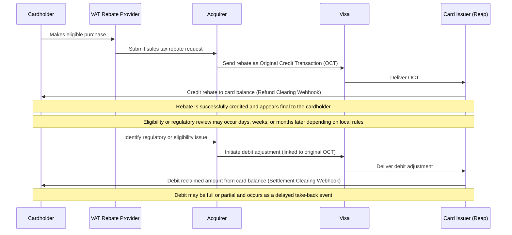

# Edge Cases

This page highlights a few unique transaction edge cases to consider when managing your card program.

# 1. Debit Adjustments for Sales Tax Reclaim OCTs

This edge case applies to sales tax rebate payouts issued as **Original Credit Transactions (OCTs)**, where funds may later need to be reclaimed due to regulatory or eligibility requirements. In these situations, recovery is handled through a **debit adjustment**, rather than reversing the original credit.

In some jurisdictions, VAT or sales tax rebate service providers are legally required to perform post-disbursement reviews. If a rebate is found to be ineligible or issued in error, a reclaim may be required even after the rebate has already been credited to the cardholder.

 

***What to Expect***

* Sales tax rebates may be paid as an Original Credit Transaction (OCT), which is a credit sent directly to a cardholder’s card account rather than a refund of a purchase.
* If the rebate later needs to be reclaimed due to regulatory or eligibility requirements, the card network may process a separate debit adjustment to recover funds. This is not a reversal of the original credit.
* The debit adjustment is typically linked to the original rebate credit for reconciliation, so related identifiers (`tid` and `lifecycle_event_id`) may appear across both events.
* The reclaimed amount may be full or partial, and it can appear days, weeks, or even months after the original rebate payout depending on local rules.

<Callout icon="❗️" theme="error">
  **Recommendation**: Design your ledgering and customer support flows to expect a delayed “take-back” event, and avoid treating it as a refund, chargeback, or transaction error.
</Callout>

 

***Sample Scenario***

The diagram below illustrates a typical sales tax rebate flow, including a delayed eligibility review that may result in a debit adjustment.

 

***Key Takeaway***

Sales tax rebate OCTs can be followed by delayed debit adjustments due to regulatory requirements. Programs should treat these as expected recovery events and ensure systems and support processes are designed to handle them correctly.